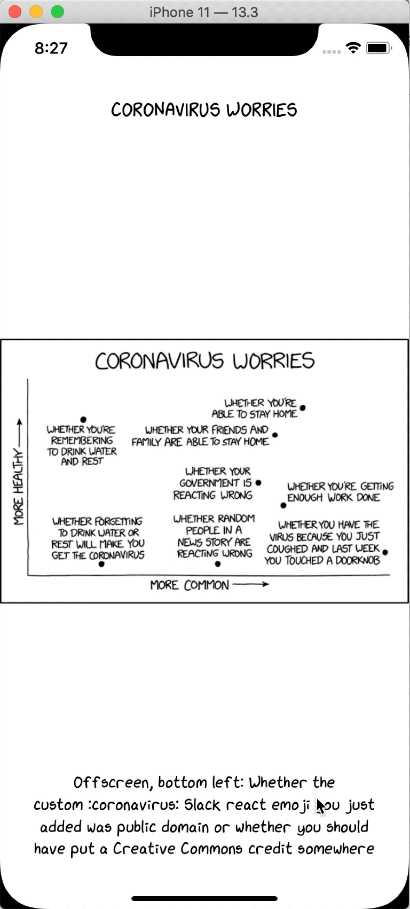

# JanjiXkcd

A XKCD comic reader

## Things I want to learn from this project

- Package management with [Carthage](https://github.com/Carthage/Carthage)
- Concept of promises with [PromiseKit](https://github.com/mxcl/PromiseKit)

## Attributions

[XKCD](https://xkcd.com/license.html)